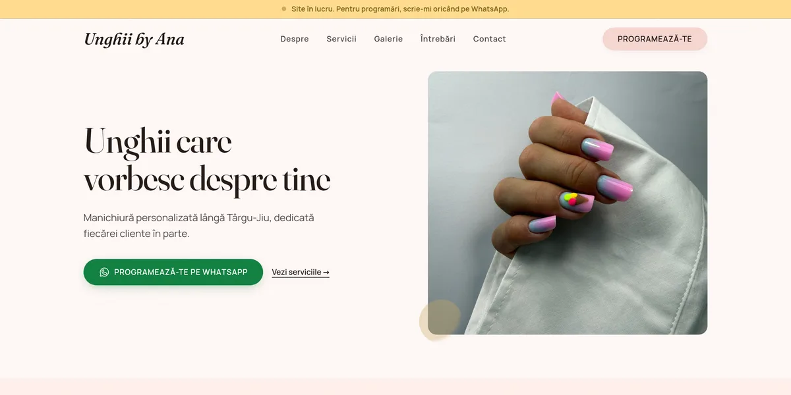
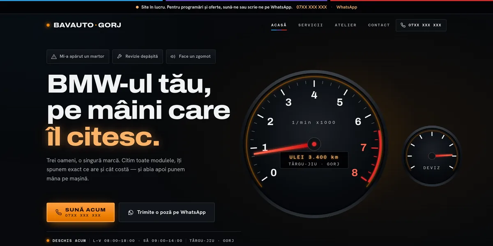
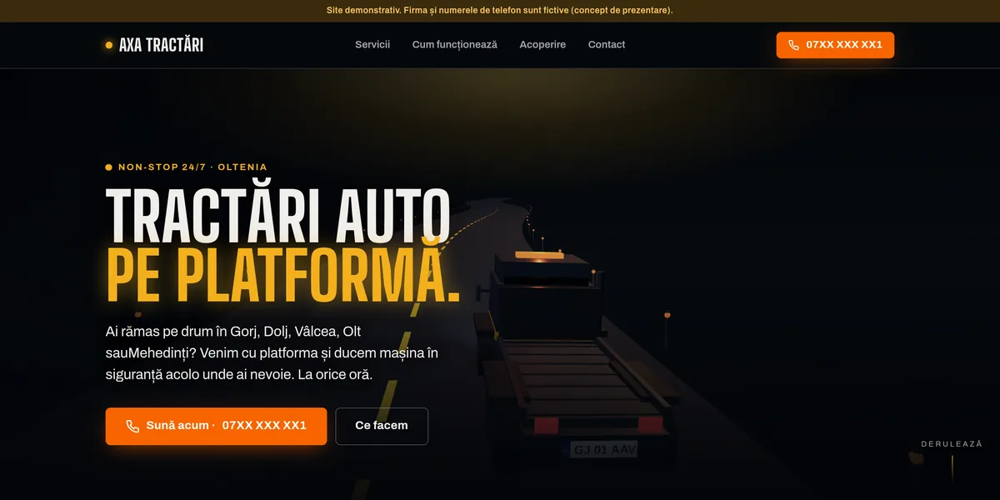
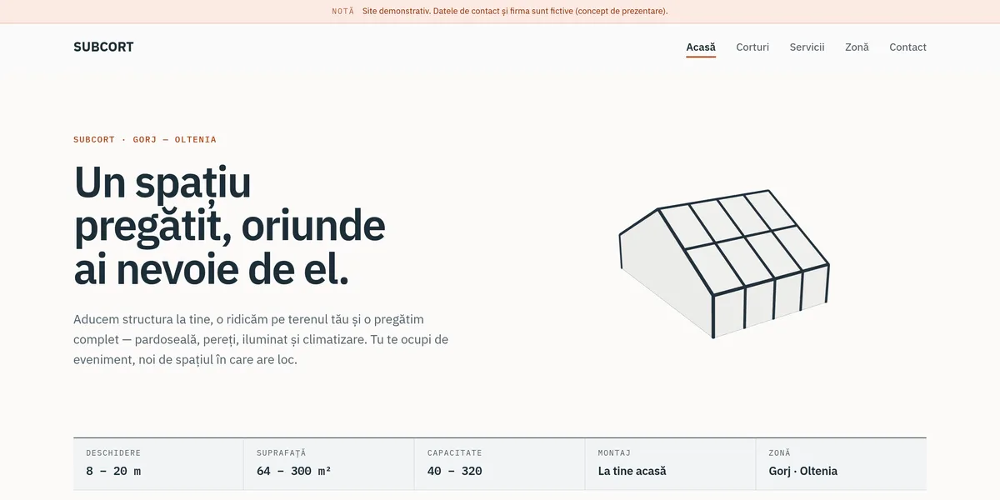
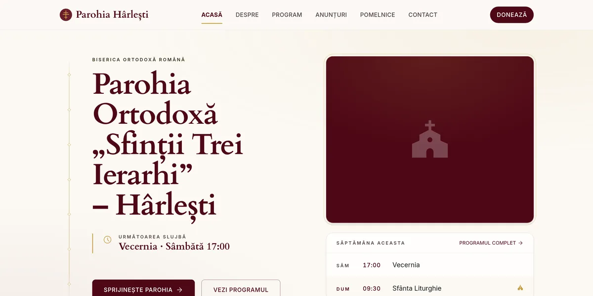
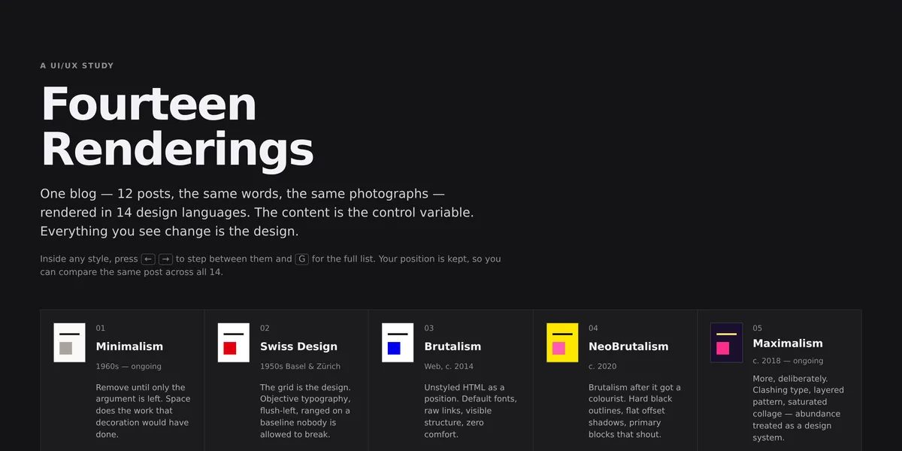

# presentation-sites

Websites for small businesses in Gorj, Romania, one static Astro site per business, kept together in one npm-workspaces repo. It also holds Churchix, a platform for parish sites, and a design study.

<table>
<tr>
<td width="33%" valign="top"><a href="https://gandolh.ro/saloon/"></a><br><b>Nail salon</b>, Târgu-Jiu<br><a href="https://gandolh.ro/saloon/">gandolh.ro/saloon</a></td>
<td width="33%" valign="top"><a href="https://gandolh.ro/auto-service/"></a><br><b>BMW repair garage</b>, Târgu-Jiu<br><a href="https://gandolh.ro/auto-service/">gandolh.ro/auto-service</a></td>
<td width="33%" valign="top"><a href="https://gandolh.ro/tractari/"></a><br><b>Car towing</b> demo, Oltenia<br><a href="https://gandolh.ro/tractari/">gandolh.ro/tractari</a></td>
</tr>
<tr>
<td width="33%" valign="top"><a href="https://gandolh.ro/subcort/"></a><br><b>Event tent rental</b> demo, Gorj<br><a href="https://gandolh.ro/subcort/">gandolh.ro/subcort</a></td>
<td width="33%" valign="top"><a href="https://gandolh.ro/churchix/"></a><br><b>Orthodox parish</b> on the Churchix platform<br><a href="https://gandolh.ro/churchix/">gandolh.ro/churchix</a></td>
<td width="33%" valign="top"><a href="https://gandolh.ro/design-study/"></a><br><b>Design study</b>: one blog in 14 styles<br><a href="https://gandolh.ro/design-study/">gandolh.ro/design-study</a></td>
</tr>
</table>

**Status:** Maintenance and demos, as of the [2026-10-07 status page](corpus/wiki/status.md). All six are live on gandolh.ro. The two client sites, the salon and the garage, are code-complete and wait on the owners' real data, so both still show a "site în lucru" banner. The towing and tent sites are finished demos for made-up firms. Churchix is the only one with an open roadmap.

## What it does

- Gives each business its own Romanian-language site, built around one action: phone the business or message it on WhatsApp.
- Builds each site to plain static files, which Caddy serves under the site's own path on gandolh.ro.
- Keeps real phone numbers, addresses and photos out of git. They sit in gitignored files that the build merges in, so a clone builds with placeholders.
- Gives every site a docs site at `/<site>/docs/`, rendered from that site's own README, PRODUCT.md, DESIGN.md and notes.

The sites share one small package, `@sites/kit`, and nothing else, so you can redesign or remove one without touching the others. There is no CMS. Content is typed TypeScript inside each site, and changing it means a rebuild. Deploy lives in a separate repo.

## How it works

`package.json` at the root is an npm-workspaces root over `sites/*`, `sites/*/docs-site` and `packages/*`. Each site is Astro 7 with static output, React islands where something has to be interactive, and Tailwind v4, except design-study, which uses none. Root scripts such as `saloon:dev` pass through to one workspace by its package name. `@sites/kit` supplies base-path URLs and the switch between committed SVG placeholders and real photos. churchix is its own monorepo inside this one, with its own lockfile. More in [docs/architecture.md](docs/architecture.md).

## Run it locally

Requires Node 22.12 or later. Tested on Node 24.

```bash
npm install            # once, at the root; covers every site
npm run tractari:dev   # Astro dev server, http://localhost:4321/ by default
```

Swap `tractari` for `saloon`, `auto-service`, `subcort` or `design-study`. The salon's dev script asks for real photos, which are not in git, so on a fresh clone run `npm run saloon -- dev:mock` instead. Builds, docs sites, churchix and the port flag: [docs/getting-started.md](docs/getting-started.md).

## Project layout

| Path | What lives there |
|---|---|
| `sites/` | One workspace per site: `saloon`, `auto-service`, `subcort`, `tractari`, `design-study`. Each has its own README, PRODUCT.md, DESIGN.md and a Starlight `docs-site/` |
| `packages/site-kit/` | `@sites/kit`, the only code the sites share |
| `churchix/` | Churchix, a white-label platform for Orthodox parish sites. Its own monorepo, not a workspace here |
| `corpus/` | The repo's wiki: layout, decisions, status, work briefs |
| `docs/` | The guides and images this README links to |
| `package.json` | Workspace root and the per-site passthrough scripts |

## Docs

- [docs/](docs/README.md): every site with its live URL, docs site and README, plus setup, architecture and adding a site
- Docs sites: `https://gandolh.ro/<site>/docs/`, for example [gandolh.ro/saloon/docs](https://gandolh.ro/saloon/docs/)
- [Project wiki](corpus/index.md): decisions, status and the briefs behind past work
- [churchix/README.md](churchix/README.md) and its own [wiki](churchix/corpus/index.md)

## License

No license file yet; all rights reserved.
