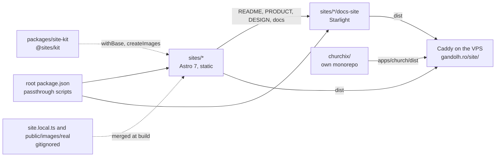

# Architecture

The repo is an npm-workspaces root with three kinds of workspace: the sites, their docs sites, and one shared package. churchix sits beside them as a separate monorepo. Every site and docs site builds to static files that Caddy serves under a path on gandolh.ro. The only server code is saloon's `marketing/bots/` automation service, which runs in mock mode and is not live yet.

- **sites/** holds five sites, each its own workspace. saloon, auto-service, subcort and tractari share one shape: Astro 7 with static output, React 19 islands where something has to be interactive, Tailwind v4 with its tokens in CSS, and content as typed TypeScript in `src/content/*.ts`. tractari and subcort add a Three.js hero. design-study is Astro with React islands and no Tailwind; each of its 14 themes owns its markup, CSS and fonts.
- **packages/site-kit** is `@sites/kit`. It holds the code that was byte-identical across sites: `withBase()` for sub-path URLs, `createImages()` for the placeholder/real photo switch, and the `SiteOverridesOf` type. It ships TypeScript source with no build step, so each site lists it under `vite.ssr.noExternal` and Vite compiles it per site. The bar for adding to it is identical logic, not similar logic; [its README](../packages/site-kit/README.md) lists what was kept out and why.
- **`sites/<site>/docs-site`** is a Starlight site that renders the site's own Markdown into pages at `/<site>/docs/`.
- **churchix/** is a white-label platform: shared `@churchix/*` packages and one independent Astro app per parish. It is not a workspace here because one workspace root cannot nest inside another. [churchix/CLAUDE.md](../churchix/CLAUDE.md) governs it.

## Where each kind of doc lives

Every project uses the same layout:

| Where | What |
|---|---|
| `sites/<site>/README.md` | What the site is, how to run it, its sub-path |
| `sites/<site>/PRODUCT.md` | Who it is for and what it must do |
| `sites/<site>/DESIGN.md` | The visual system |
| `sites/<site>/docs/` | Everything else: status, legal, marketing, todo lists, mostly in Romanian |
| `corpus/` | The monorepo layer: layout, cross-site conventions, decisions, status |

`PRODUCT.md` and `DESIGN.md` are [impeccable](https://github.com/pbakaus/impeccable) files and keep those exact names at the project root, because that is where the tool reads them. churchix keeps its own wiki in [churchix/corpus/](../churchix/corpus/index.md).

## A content change, start to finish

1. Edit the typed content in `sites/<site>/src/content/`. Real contact details go in the gitignored `site.local.ts`.
2. `npm run <site>:dev` shows it locally at `/`.
3. `npm run <site>:build` writes `dist/`. Deploy builds with `PUBLIC_BASE=/<site>` so every link goes through `withBase()` to the right path.
4. The deploy repo uploads `dist/` and Caddy serves it at `https://gandolh.ro/<site>/`.

## Going deeper

- [corpus/wiki/architecture.md](../corpus/wiki/architecture.md): the full as-built description, including the image pipeline and the docs-site scripts
- [corpus/wiki/decisions.md](../corpus/wiki/decisions.md): why the sites share so little, why deploy lives elsewhere, why real data is gitignored
- [corpus/wiki/design-styles.md](../corpus/wiki/design-styles.md): the 14 design-style dossiers from design-study and how to reuse them
